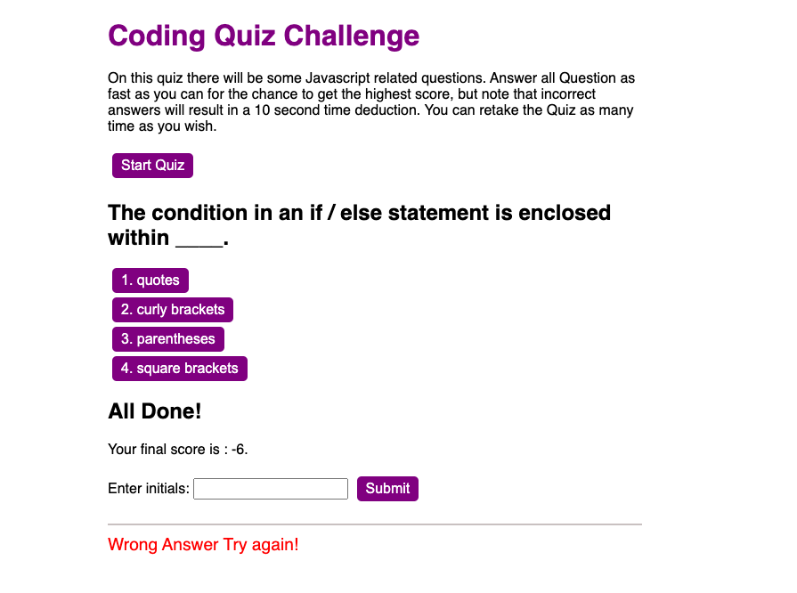

# Web-APIs-Challenge-Code-Quiz
## Project Description
UCD Bootacamp Individual Challenge 4.Creating a Code Quiz from the topics covered in class.\
Being able to show multiple choice questions  with pre-assigned answers.\
See acceptance criteria for the Challenge Below

## Acceptance Criteria

* Create a Code quiz program

* Clicking start Quiz button the timer countdown starts and presented with question with answers

* Once answer a question

* Presented with another Question

* If user get the question wrong

* Time should be deducted from the total count in this case is 10 seconds

* Oce all Questions are answered or timer reaches 0
* Game is over 
* When game is over I can save my initials and score

